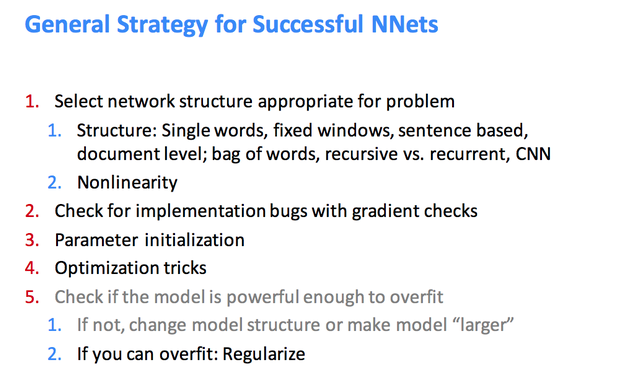

# Deep learning Playbook

>"Successfully applying deep learning techniques requires more than just a good knowledge of what algorithms exist and the principles that explain how they work...

> ...A good machine learning practitioner also needs to know how to choose an algorithm for a particular application and how to monitor and respond to feedback obtained from experiments in order to improve a machine learning system. During day to day development of machine learning systems, practitioners need to decide whether to gather more data, increase or decrease model capacity, add or remove regularizing features, improve the optimization of a model, improve approximate inference in a model, or debug the software implementation of the model. All of these operations are at the very least time-consuming to try out, so it is important to be able to determine the right course of action rather than blindly guessing." - deeplearningbook.org

---

# Table of Contents 

* Choosing appropriate Activation functions
* Weight initialisation
* Hyperparameter tuning
    * Learning rate

* Generalisation and avoiding overfitting
* Cost functions
* Optimisation
* Monitoring the training
* On GPUs
* Trouble-shooting & debugging strategies

* Saving and Loading models
* Data preprocessing & preparation
* Strategies to improve performance
	* Ensembles 
* Applied Computer vision
	* Data augmentation
	* Transfer learning 
* Applied Natural language processing
* Advice from top practitioners

---

---

# Choosing appropriate Activation functions

Every activation function (or non-linearity) takes a single number and performs a certain fixed mathematical operation on it.

There are several activation functions you may encounter in practice:
* Sigmoid
* Tanh
* ReLU
* ReLU variants - Leaky ReLU
* Maxout

__Tanh and sigmoid__

Sigmoid and Tanh are the two most commonly used activation functions. However, they are not necessarily good choices as activation functions for the hidden units.

The reasons are:
* They saturate quickly when the output value is not a narrow region (around 0), i.e. the derivative almost vanishes. This means that the network easily gets stuck or converges slowly when the pre-activated values fall outside of the region.

* There's no reason that the hidden units should be restricted to (0,1) as in the Sigmoid function or (-1,1) as in the Tanh function.

* Choose a good nonlinear function: in practice tanh tends to work better than sigmoid. The rectified linear function is also a good choice

* Derivative of the sigmoid function is always smaller than 1

__Sigmoid__

It takes a real-valued number and “squashes” it into range between 0 and 1. In particular, large negative numbers become 0 and large positive numbers become 1. In practice, the sigmoid non-linearity has recently fallen out of favor and it is rarely ever used. It has two major drawbacks:
* Sigmoids saturate and kill gradients.
* Sigmoid outputs are not zero-centered.

__Tanh__

It squashes a real-valued number to the range [-1, 1].
Like the sigmoid neuron, its activations saturate, but unlike the sigmoid neuron its output is zero-centered. Therefore, in practice the tanh non-linearity is always preferred to the sigmoid nonlinearity. Some evidence suggests it outperforms sigmoid neurons

tanh is just a rescaled and shifted sigmoid, but better for many models
    • Initialization: values close to 0
    • Convergence: faster in practice
    • Nice derivative (similar to sigmoid)    

shape approximates the sigmoid function, but ranges from -1 to 1 instead of zero to one, thereby facilitating both positive and negative activations

ReLU
rectified linear unit or rectified linear neuron

* Computationally simpler relative to sigmoid or tanh, but in a network can approximate their performance and nevertheless compute any function
* The Rectified Linear Unit has become very popular in the last few years.
* It computes the function f(x)=max(0,x)

* In other words, the activation is simply thresholded at zero (see image above on the left). There are several pros and cons to using the ReLUs:
        (+) It was found to greatly accelerate (e.g. a factor of 6 in Krizhevsky et al.) the convergence of stochastic gradient descent compared to the sigmoid/tanh functions. It is argued that this is due to its linear, non-saturating form.
        (+) Compared to tanh/sigmoid neurons that involve expensive operations (exponentials, etc.), the ReLU can be implemented by simply thresholding a matrix of activations at zero.
        (-) Unfortunately, ReLU units can be fragile during training and can “die”. For example, a large gradient flowing through a ReLU neuron could cause the weights to update in such a way that the neuron will never activate on any datapoint again. If this happens, then the gradient flowing through the unit will forever be zero from that point on. That is, the ReLU units can irreversibly die during training since they can get knocked off the data manifold. For example, you may find that as much as 40% of your network can be “dead” (i.e. neurons that never activate across the entire training dataset) if the learning rate is set too high. With a proper setting of the learning rate this is less frequently an issue.

Reason
1. Fast to compute
2. Biological reason
3. Infinite sigmoid with different biases
4. Solution for vanishing gradient

ReLU variants:
LReLU & PReLU
Maxout

__Leaky ReLU__
Leaky ReLUs are one attempt to fix the “dying ReLU” problem. Instead of the function being zero when x < 0, a leaky ReLU will instead have a small negative slope (of 0.01, or so).

__PReLU neurons__
The slope in the negative region can also be made into a parameter of each neuron, as seen in PReLU neurons,

__Maxout__
One relatively popular choice is the Maxout neuron (introduced recently by Goodfellow et al.) that generalizes the ReLU and its leaky version. The Maxout neuron computes the function max(wT1x+b1,wT2x+b2)
Notice that both ReLU and Leaky ReLU are a special case of this form (for example, for ReLU we have w1,b1=0. The Maxout neuron therefore enjoys all the benefits of a ReLU unit (linear regime of operation, no saturation) and does not have its drawbacks (dying ReLU).

However, unlike the ReLU neurons it doubles the number of parameters for every single neuron, leading to a high total number of parameters. This concludes our discussion of the most common types of neurons and their activation functions. As a last comment, it is very rare to mix and match different types of neurons in the same network, even though there is no fundamental problem with doing so.

__Takeaway__

Choose the right activation function (linear, sigmoid, tanh, relu etc) and the right loss/divergence function (MSE, Cross entropy, binary cross-entropy etc) based on your data

TLDR: “What neuron type should I use?” Use the ReLU non-linearity, be careful with your learning rates and possibly monitor the fraction of “dead” units in a network.
If this concerns you, give Leaky ReLU or Maxout a try.

Never use sigmoid.
Try tanh, but expect it to work worse than ReLU/Maxout.

Avoid Sigmoid's, TanH's gates they are expensive and get saturated and may stop back propagation. In fact the deeper your network the less attractive Sigmoid's and TanH's are.

Use the much cheaper and effective ReLU's and PreLU's instead. As mentioned in Deep Sparse Rectifier Neural Networks they promote sparsity and their back propagation is much more robust. Don't use ReLU or PreLU's gates before max pooling, instead apply it after to save computation. Don't use ReLU's they are so 2012. Yes they are a very useful non-linearity that solved a lot of problems. However try fine-tuning a new model and watch nothing happen because of bad initialization with ReLU's blocking backpropagation. Instead use PreLU's with a very small multiplier usually 0.1. Using PreLU's converges faster and will not get stuck like ReLU's during the initial stages. ELU's are still good but expensive.

---
---

# Weight Initialization

* Worry and care about your initialization. Try many different kinds of initialization. This effort will pay off. If the net doesn’t work at all (i.e., never “gets off the ground”), keep applying pressure to the random initialization. It’s the right thing to do.

* Worry about the random initialization of the weights at the start of learning. If you are lazy, it is usually enough to do something like 0.02 * randn(num_params).

* If it doesn’t work well (say your neural network architecture is unusual and/or very deep), then you should initialize each weight matrix with the init_scale / sqrt(layer_width) * randn. In this case init_scale should be set to 0.1 or 1, or something like that. Random initialization is super important for deep and recurrent nets.Researchers believed, for many years, that SGD cannot train deep neural networks from random initializations. Every time they would try it, it wouldn’t work. Embarrassingly, they did not succeed because they used the “small random weights” for the initialization, which works great for shallow nets but simply doesn’t work for deep nets at all. When the nets are deep, the many weight matrices all multiply each other, so the effect of a suboptimal scale is amplified.

* Ensure you have a good weight initialisation. This is essential for training Deep Neural Networks. You can either use Xavier Init,  He Init, Denoising Stacked Autoencoder, Restricted Boltzmann Machines. Use xavier initialization as much as possible. Use it only on large Fully Connected layers and avoid them on the CNN layers.

* To initialize weights and biases: to avoid initial saturation of neurons, sample randomly from a normal distribution with mean of zero and a standard deviation of 1/√(n inputs)

* Borrow the weight for the hidden layer from another similar task as initialization values.

* Pitfall: all zero initialization. Small random numbers - we still want the weights to be very close to zero, but as we have argued above, not identically zero.

* Calibrating the variances with 1/sqrt(n). It turns out that we can normalize the variance of each neuron’s output to 1 by scaling its weight vector by the square root of its fan-in (i.e. its number of inputs). That is, the recommended heuristic is to initialize each neuron’s weight vector as: w = np.random.randn(n) / sqrt(n), where n is the number of its inputs.

* Another recommendation. This gives the initialization w = np.random.randn(n) * sqrt(2.0/n), and is the current recommendation for use in practice in the specific case of neural networks with ReLU neurons.

* Sparse initialization - Another way to address the uncalibrated variances problem is to set all weight matrices to zero, but to break symmetry every neuron is randomly connected (with weights sampled from a small gaussian as above) to a fixed number of neurons below it.A typical number of neurons to connect to may be as small as 10

* Initializing the biases. It is more common to simply use 0 bias initialization.
  
* In practice, the current recommendation is to use ReLU units and use the w = np.random.randn(n) * sqrt(2.0/n)

* Use batch normalization - Use Batch Normalization (check paper Batch Normalization: Accelerating Deep Network Training by Reducing Internal Covariate Shift) ALWAYS. It works and it is great. It allows faster convergence ( much faster) and smaller datasets. You will save time and resources. Batch Normalization alleviates a lot of headaches with properly initializing neural networks by explicitly forcing the activations throughout a network to take on a unit gaussian distribution at the beginning of the training. In practice networks that use Batch Normalization are significantly more robust to bad initialization. Additionally, batch normalization can be interpreted as doing preprocessing at every layer of the network, but integrated into the network itself in a differentiably manner. Neat!    

---
---

# Handling Overfitting 

To avoid overfitting:
    Early Stopping - stop training early, i.e., when classification accuracy on test data flattens
    Dropout - use the popular dropout methodology(inverted dropout)
    artificially expand your data set, e.g., by rotating MNIST digits slightly or adding noise to audio recordings
    Regularization: we covered L1 and L2 regularization in detail, with nuclear physicist Thomas Balestri leading elucidation and pictured below

Dropout, Regularization
Use techniques like Dropout[5] and Regularization to avoid overfitting

Neural net is notorious for being prone to overfitting, due to its massive number of parameters (a.k.a. large capacity). A simple but effective way to prevent overfitting is using dropout. Dropout is a clever use of model ensembling in a large neural net.

Always use dropout to minimize the chance of overfitting. Use it after large > 256 (fully connected layers or convolutional layers). There is an excellent thesis about that (Dropout as a Bayesian Approximation: Representing Model Uncertainty in Deep Learning)

Remember to tune the dropout probability, and to not forget to turn off Dropout and to multiply the weights by (namely by 1-dropout probability) at test time.
So now that we have established that “dropout” is important…what is dropout?
L1 lasso regularization appears to be more widely used than L2 ridge regularization in the statistical machine learning community.
As a direct consequence of L1 or L2 regularization parameter values which do not contribute significantly to predictive performance are forced towards the value of zero thus reducing the complexity of the network. Or to summarize these ideas in a more concise way, regularization constraints of these types make it “harder” to learn statistical regularities which tends to “filter out” inconsistent weak statistical regularities and bias the system to learn the more consistent strong statistical regularities.

Many machine learning researchers consider “dropout” to play a role similar to L1-regularization and L2-regularization. By picking a hidden unit and its connections at a particular learning trial to be temporarily ignored with some probability P for that learning trial, it is claimed that this tends to force the hidden units to work more independently and not be as “dependent” upon other hidden units.  The following analogy might help explain this phenomenon.

But there is, in fact, a deeper level of understanding of what is going on here. In fact, I think that the concept of “dropout” as a type of regularization is actually confusing the issue. It makes more sense to think of “dropout” as implementing a system of “model averaging” which I will now explain briefly.
To summarize, dropout is commonly referred to as a regularization strategy but in fact it is probably best viewed as a crude approximation to a model averaging strategy. Model averaging is an important and complex topic and actually deserves its own podcast episode. but I will provide a very brief introduction here. Eventually we will have a special podcast on model averaging, Bayesian model averaging, and Frequentist model averaging.

Generalization - Practical tricks
    1)find the right network structure and implement and optimize it properly
    2) make the model overfit on training data
    3) prevent overfitting
        ◦ Reduce the model size by lowering the number of units and layers/hyperparameters
        ◦ Early stopping
        ◦ Standard L1 or L2 regularization
        ◦ Sparsity constraint
        
Max norm constraints        

Theme of noise in forward pass

Bias regularization.

Per-layer regularization. It is not very common to regularize different layers to different amounts (except perhaps the output layer). Relatively few results regarding this idea have been published in the literature.

In practice: It is most common to use a single, global L2 regularization strength that is cross-validated. It is also common to combine this with dropout applied after all layers. The value of p=0.5 is a reasonable default, but this can be tuned on validation data.

Initialize the weights by drawing them from a gaussian distribution with standard deviation of sqrt(2/n), where n is the number of inputs to the neuron.
E.g. in numpy: w = np.random.randn(n) * sqrt(2.0/n)
Use L2 regularization and dropout (the inverted version)

Generalization
Early Stopping: avoid too many iterations from overfitting
Check performance on validation set to prevent training too many iterations

Regularization: minimize the effect of noise
    
Idea: the parameters closer to zero are preferred
To minimize the effect of noise, we want w close to zero.
Idea: optimize a new cost function to find a set of weight that
1) minimizes original cost and
2) is close to zero
        
Dropout: leverage the benefit of ensemble
For each iteration of training,
◦ each neuron has p% to dropout

For each iteration of training,
◦ each neuron has p% to dropout
◦ training using the new network

For testing,
◦ no dropout
◦ if the dropout rate at training is p%, all the weights times (1-p)%
◦ e.g. the dropout rate is 50%, 𝑤𝑙 = 1 𝑖𝑗

from training -> 𝑤𝑙 = 0.5 for testing    

Train a bunch of networks with different structures

Dropout – Ensemble        

Training
◦ Using one data to train one network
◦ Some parameters in the network are shared    

Dropout Tips

Larger network
◦ If you know that your task needs n neurons, for dropout rate p, your
network need n/(1-p) neurons.
Longer training time
Higher learning rate
Larger momentum

---
---
